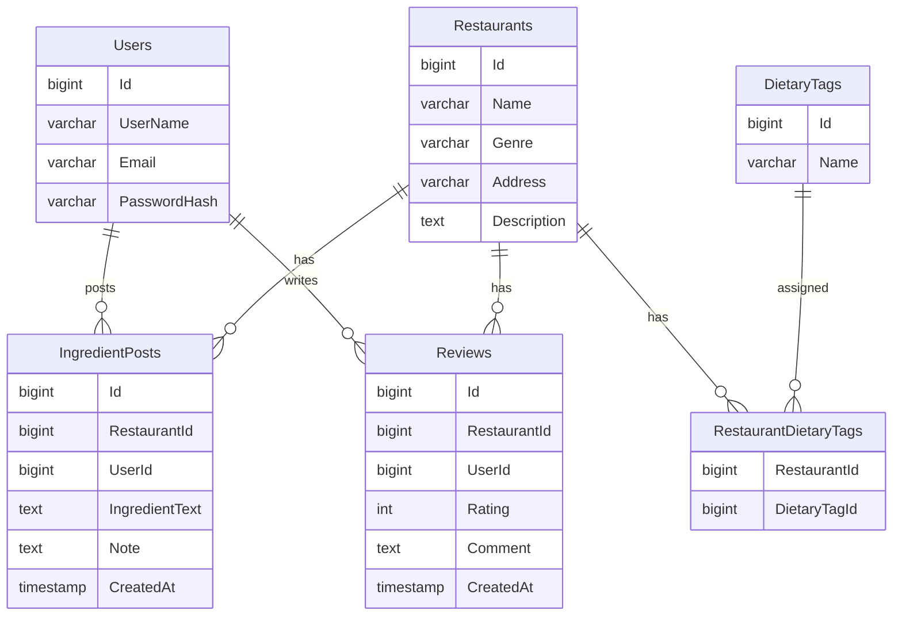

# SafeBite VN-JP 内部設計書（ドラフト）


追加

| 項目 | 内容 |
|---|---|
| プロジェクト名 | SafeBite VN-JP |
| バージョン | 0.1（ドラフト） |
| 作成日 | 2026-05-20 |
| ステータス | レビュー前 |

> 本書は要件定義書・外部設計書をもとに、SafeBite VN-JP の内部構造・DB設計・クラス構成・処理方式など実装レベルの仕様を整理した内部設計書である。

---

# 1. システム構成

```txt
Browser
   ↓
ASP.NET Core MVC (.NET 8)
   ↓
Controller
   ↓
Service
   ↓
Repository
   ↓
Entity Framework Core
   ↓
PostgreSQL 16
```

---

# 2. ディレクトリ構成

```txt
SafeBite-VNJP
 ┣ Controllers
 ┃ ┣ AccountController.cs
 ┃ ┣ RestaurantsController.cs
 ┃ ┣ IngredientPostsController.cs
 ┃ ┣ ReviewsController.cs
 ┃ ┗ MyPageController.cs
 ┃
 ┣ Models
 ┃ ┣ User.cs
 ┃ ┣ Restaurant.cs
 ┃ ┣ IngredientPost.cs
 ┃ ┣ Review.cs
 ┃ ┗ DietaryTag.cs
 ┃
 ┣ Data
 ┃ ┗ AppDbContext.cs
 ┃
 ┣ Services
 ┃ ┣ RestaurantService.cs
 ┃ ┣ ReviewService.cs
 ┃ ┗ IngredientService.cs
 ┃
 ┣ Repositories
 ┃ ┣ RestaurantRepository.cs
 ┃ ┣ ReviewRepository.cs
 ┃ ┗ IngredientRepository.cs
 ┃
 ┣ Views
 ┣ wwwroot
 ┣ doc
 ┗ Program.cs
```

---

# 3. DB設計

## 3.1 ER図



---

# 4. テーブル定義

## 4.1 Users

| カラム名 | 型 | NULL | 説明 |
|---|---|---|---|
| Id | bigint | No | ユーザーID |
| UserName | varchar(50) | No | ユーザー名 |
| Email | varchar(255) | No | メールアドレス |
| PasswordHash | text | No | パスワードハッシュ |

---

## 4.2 Restaurants

| カラム名 | 型 | NULL | 説明 |
|---|---|---|---|
| Id | bigint | No | 店舗ID |
| Name | varchar(100) | No | 店舗名 |
| Genre | varchar(50) | No | ジャンル |
| Address | varchar(255) | Yes | 住所 |
| Description | text | Yes | 店舗説明 |

---

## 4.3 IngredientPosts

| カラム名 | 型 | NULL | 説明 |
|---|---|---|---|
| Id | bigint | No | 投稿ID |
| RestaurantId | bigint | No | 店舗ID |
| UserId | bigint | No | 投稿者ID |
| IngredientText | text | No | 使用食材 |
| Note | text | Yes | 補足情報 |
| CreatedAt | timestamp | No | 投稿日時 |

---

## 4.4 Reviews

| カラム名 | 型 | NULL | 説明 |
|---|---|---|---|
| Id | bigint | No | レビューID |
| RestaurantId | bigint | No | 店舗ID |
| UserId | bigint | No | 投稿者ID |
| Rating | int | No | 評価（1〜5） |
| Comment | text | No | コメント |
| CreatedAt | timestamp | No | 投稿日時 |

---

# 5. Controller設計

| Controller | 主な役割 |
|---|---|
| AccountController | ログイン・登録・ログアウト |
| RestaurantsController | 店舗一覧・詳細表示 |
| IngredientPostsController | 食材情報投稿 |
| ReviewsController | レビュー投稿 |
| MyPageController | マイページ表示 |

---

# 6. Action設計

| Controller | Action | Method | 概要 |
|---|---|---|---|
| Account | Login | GET/POST | ログイン処理 |
| Account | Register | GET/POST | ユーザー登録 |
| Restaurants | Index | GET | 店舗一覧 |
| Restaurants | Details | GET | 店舗詳細 |
| IngredientPosts | Create | GET/POST | 食材投稿 |
| Reviews | Create | GET/POST | レビュー投稿 |
| MyPage | Index | GET | マイページ |

---

# 7. バリデーション設計

## 7.1 ユーザー登録

| 項目 | 条件 |
|---|---|
| UserName | 必須、50文字以内 |
| Email | 必須、メール形式 |
| Password | 必須、8文字以上 |

---

## 7.2 食材情報投稿

| 項目 | 条件 |
|---|---|
| IngredientText | 必須 |
| Note | 1000文字以内 |

---

## 7.3 レビュー投稿

| 項目 | 条件 |
|---|---|
| Rating | 1〜5 |
| Comment | 必須 |
| Comment | 500文字以内 |

---

# 8. 認証・認可設計

| 機能 | 認証 |
|---|---|
| 店舗一覧・詳細 | 不要 |
| 食材投稿 | 必須 |
| レビュー投稿 | 必須 |
| 投稿削除 | 投稿者本人のみ |

---

# 9. セキュリティ設計

| 項目 | 対策 |
|---|---|
| SQL Injection | Entity Framework Core使用 |
| XSS | Razor自動エスケープ |
| CSRF | AntiForgeryToken使用 |
| パスワード | ASP.NET Identityによるハッシュ化 |

---

# 10. エラー処理設計

| エラー | 対応 |
|---|---|
| 404 | NotFoundページ表示 |
| 500 | Error画面表示 |
| 未ログイン投稿 | ログイン画面へリダイレクト |
| 権限不足 | 403 Forbidden |

---

# 11. ログ設計

| ログ種別 | 内容 |
|---|---|
| ErrorLog | 例外情報 |
| AccessLog | アクセス履歴 |
| AuthLog | ログイン履歴 |

---

# 12. 使用技術一覧

| 分類 | 技術 |
|---|---|
| バックエンド | ASP.NET Core MVC (.NET 8) |
| ORM | Entity Framework Core |
| DB | PostgreSQL 16 |
| 認証 | ASP.NET Core Identity |
| UI | Bootstrap 5 |
| フロント | Razor View |
| ホスティング | Render（予定） |

---

# 改訂履歴

| 改定日 | バージョン | 改訂者 | 改定箇所 | 改定内容 |
|---|---|---|---|---|
| 2026-05-20 | 0.1 | 担当者 | – | 初版作成（DB設計 / Controller設計 / Action設計 / バリデーション設計） |
