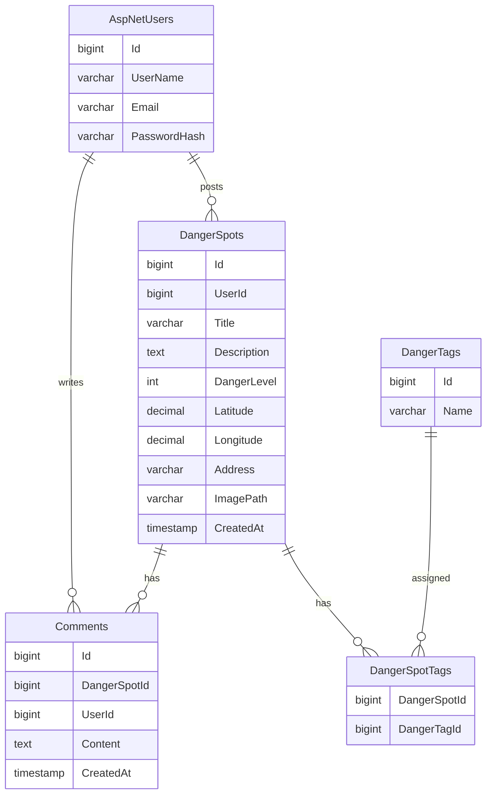

# SafeWalk VN-JP 内部設計書（ドラフト）

| 項目 | 内容 |
|---|---|
| プロジェクト名 | SafeWalk VN-JP |
| バージョン | 0.1（ドラフト） |
| 作成日 | 2026-05-25 |
| ステータス | レビュー前 |

> 本書は要件定義書・外部設計書をもとに、SafeWalk VN-JP の内部構造・DB設計・クラス構成・処理方式など実装レベルの仕様を整理した内部設計書である。

---

# 1. システム構成

```txt
Browser
   ↓
ASP.NET Core MVC (.NET 9)
   ↓
Controller
   ↓
Service
   ↓
Repository
   ↓
Entity Framework Core
   ↓
PostgreSQL 16
```

---

# 2. ディレクトリ構成

```txt
SafeWalk-VNJP
 ┣ Areas
 ┃ ┗ Identity
 ┃
 ┣ Controllers
 ┃ ┣ HomeController.cs
 ┃ ┣ DangerSpotsController.cs
 ┃ ┣ CommentsController.cs
 ┃ ┣ MapController.cs
 ┃ ┗ MyPageController.cs
 ┃
 ┣ Models
 ┃ ┣ DangerSpot.cs
 ┃ ┣ Comment.cs
 ┃ ┣ DangerTag.cs
 ┃ ┗ DangerSpotTag.cs
 ┃
 ┣ Data
 ┃ ┗ AppDbContext.cs
 ┃
 ┣ Services
 ┃ ┣ DangerSpotService.cs
 ┃ ┣ CommentService.cs
 ┃ ┗ MapService.cs
 ┃
 ┣ Repositories
 ┃ ┣ DangerSpotRepository.cs
 ┃ ┣ CommentRepository.cs
 ┃ ┗ MapRepository.cs
 ┃
 ┣ Views
 ┣ wwwroot
 ┃ ┣ images
 ┃ ┗ uploads
 ┃
 ┣ doc
 ┗ Program.cs
```

---

# 3. DB設計

## 3.1 ER図



---

# 4. テーブル定義

## 4.1 AspNetUsers

| カラム名 | 型 | NULL | 説明 |
|---|---|---|---|
| Id | bigint | No | ユーザーID |
| UserName | varchar(50) | No | ユーザー名 |
| Email | varchar(255) | No | メールアドレス |
| PasswordHash | text | No | パスワードハッシュ |

> ASP.NET Core Identity 標準テーブルを使用する。

---

## 4.2 DangerSpots

| カラム名 | 型 | NULL | 説明 |
|---|---|---|---|
| Id | bigint | No | 危険地点ID |
| UserId | bigint | No | 投稿者ID |
| Title | varchar(100) | No | 地点名 |
| Description | text | Yes | 危険内容 |
| DangerLevel | int | No | 危険度（1〜5） |
| Latitude | decimal | Yes | 緯度 |
| Longitude | decimal | Yes | 経度 |
| Address | varchar(255) | Yes | 住所 |
| ImagePath | varchar(255) | Yes | 画像パス |
| CreatedAt | timestamp | No | 投稿日時 |

---

## 4.3 Comments

| カラム名 | 型 | NULL | 説明 |
|---|---|---|---|
| Id | bigint | No | コメントID |
| DangerSpotId | bigint | No | 危険地点ID |
| UserId | bigint | No | 投稿者ID |
| Content | text | No | コメント内容 |
| CreatedAt | timestamp | No | 投稿日時 |

---

## 4.4 DangerTags

| カラム名 | 型 | NULL | 説明 |
|---|---|---|---|
| Id | bigint | No | タグID |
| Name | varchar(50) | No | タグ名 |

---

## 4.5 DangerSpotTags

| カラム名 | 型 | NULL | 説明 |
|---|---|---|---|
| DangerSpotId | bigint | No | 危険地点ID |
| DangerTagId | bigint | No | タグID |

---

# 5. Controller設計

| Controller | 主な役割 |
|---|---|
| HomeController | トップ・プライバシー・エラー |
| DangerSpotsController | 危険地点一覧・詳細・投稿 |
| CommentsController | コメント投稿 |
| MapController | Google Map表示 |
| MyPageController | マイページ表示 |

---

# 6. Action設計

| Controller | Action | Method | 概要 |
|---|---|---|---|
| Home | Index | GET | トップ画面 |
| DangerSpots | Index | GET | 危険地点一覧 |
| DangerSpots | Details | GET | 危険地点詳細 |
| DangerSpots | Create | GET/POST | 危険地点投稿 |
| Comments | Create | GET/POST | コメント投稿 |
| Map | Index | GET | 地図表示 |
| MyPage | Index | GET | マイページ |

---

# 7. バリデーション設計

## 7.1 ユーザー登録

| 項目 | 条件 |
|---|---|
| UserName | 必須、50文字以内 |
| Email | 必須、メール形式 |
| Password | 必須、8文字以上 |

---

## 7.2 危険地点投稿

| 項目 | 条件 |
|---|---|
| Title | 必須、100文字以内 |
| Description | 2000文字以内 |
| DangerLevel | 1〜5 |
| ImagePath | jpg / png のみ |

---

## 7.3 コメント投稿

| 項目 | 条件 |
|---|---|
| Content | 必須 |
| Content | 500文字以内 |

---

# 8. 認証・認可設計

| 機能 | 認証 |
|---|---|
| 危険地点一覧・詳細 | 不要 |
| 危険地点投稿 | 必須 |
| コメント投稿 | 必須 |
| 投稿削除 | 投稿者本人のみ |

---

# 9. セキュリティ設計

| 項目 | 対策 |
|---|---|
| SQL Injection | Entity Framework Core使用 |
| XSS | Razor自動エスケープ |
| CSRF | AntiForgeryToken使用 |
| パスワード | ASP.NET Identityによるハッシュ化 |
| 画像アップロード | 拡張子制限・サイズ制限 |

---

# 10. エラー処理設計

| エラー | 対応 |
|---|---|
| 404 | NotFoundページ表示 |
| 500 | Error画面表示 |
| 未ログイン投稿 | ログイン画面へリダイレクト |
| 権限不足 | 403 Forbidden |
| 不正画像投稿 | バリデーションエラー |

---

# 11. ログ設計

| ログ種別 | 内容 |
|---|---|
| ErrorLog | 例外情報 |
| AccessLog | アクセス履歴 |
| AuthLog | ログイン履歴 |
| UploadLog | 画像アップロード履歴 |

---

# 12. 危険度判定ロジック

| 条件 | 加点 |
|---|---|
| 信号なし | +2 |
| 歩道なし | +2 |
| バイク密集 | +3 |
| 夜暗い | +2 |
| 横断困難 | +3 |

## 判定基準

| 合計点 | 危険度 |
|---|---|
| 1〜2 | 1 |
| 3〜4 | 2 |
| 5〜6 | 3 |
| 7〜8 | 4 |
| 9以上 | 5 |

---

# 13. 使用技術一覧

| 分類 | 技術 |
|---|---|
| バックエンド | ASP.NET Core MVC (.NET 9) |
| ORM | Entity Framework Core |
| DB | PostgreSQL 16 |
| 認証 | ASP.NET Core Identity |
| UI | Bootstrap 5 |
| フロント | Razor View |
| 地図 | Google Maps API |
| ホスティング | Render（予定） |

---

# 14. 今後追加予定機能

- 危険地点お気に入り機能
- 危険地点検索機能
- タグ検索機能
- 現在地取得機能
- 危険度ランキング
- 日本・ベトナム比較分析ページ

---

# 改訂履歴

| 改定日 | バージョン | 改訂者 | 改定箇所 | 改定内容 |
|---|---|---|---|---|
| 2026-05-25 | 0.1 | 担当者 | – | 初版作成（DB設計 / Controller設計 / Action設計 / バリデーション設計） |