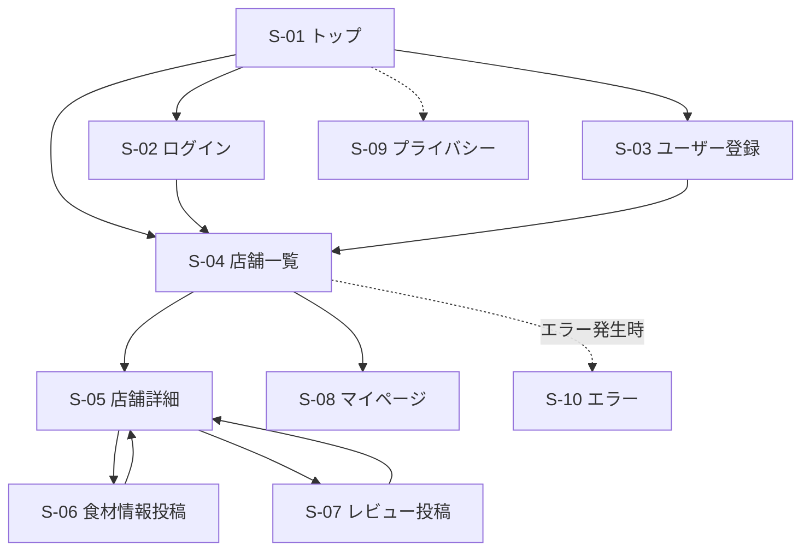

# SafeBite VN-JP 外部設計書（ドラフト）

| 項目 | 内容 |
|---|---|
| プロジェクト名 | SafeBite VN-JP |
| バージョン | 0.1（ドラフト） |
| 作成日 | 2026-05-20 |
| ステータス | レビュー前 |

> 本書は要件定義書 `要件定義書.md` を踏まえ、SafeBite VN-JP の画面・機能・画面遷移など、外部から見える仕様を整理した外部設計書である。  
> 詳細な UI デザイン・ワイヤーフレームは Figma にて別途作成予定とする。

---

# 1. 画面一覧

## 1.1 画面（GET でビューを返すもの）

| ID | 画面名 | URL | コントローラ.アクション | 認証 | 概要 |
|---|---|---|---|---|---|
| S-01 | トップ | `/` | `HomeController.Index` | 不要 | アプリ紹介・検索導線 |
| S-02 | ログイン | `/Account/Login` | `AccountController.Login` | 不要 | メール / パスワード認証 |
| S-03 | ユーザー登録 | `/Account/Register` | `AccountController.Register` | 不要 | ユーザー新規登録 |
| S-04 | 店舗一覧 | `/Restaurants` | `RestaurantsController.Index` | 不要 | 店舗一覧・検索・タグ表示 |
| S-05 | 店舗詳細 | `/Restaurants/Details/{id}` | `RestaurantsController.Details` | 不要 | 店舗詳細・レビュー・食材情報表示 |
| S-06 | 食材情報投稿 | `/IngredientPosts/Create/{restaurantId}` | `IngredientPostsController.Create` | 要 | 食材情報投稿フォーム |
| S-07 | レビュー投稿 | `/Reviews/Create/{restaurantId}` | `ReviewsController.Create` | 要 | レビュー投稿フォーム |
| S-08 | マイページ | `/MyPage` | `MyPageController.Index` | 要 | 自分の投稿一覧表示 |
| S-09 | プライバシー | `/Home/Privacy` | `HomeController.Privacy` | 不要 | プライバシーポリシー |
| S-10 | エラー | `/Home/Error` | `HomeController.Error` | 不要 | エラー表示画面 |

---

## 1.2 画面を持たない POST アクション

| アクション | URL | トリガー | 概要 |
|---|---|---|---|
| ログアウト | `POST /Account/Logout` | ナビバー | サインアウト処理 |
| 食材情報削除 | `POST /IngredientPosts/Delete/{id}` | 投稿一覧 | 投稿削除 |
| レビュー削除 | `POST /Reviews/Delete/{id}` | 投稿一覧 | レビュー削除 |

---

# 2. 画面遷移図

> 認証が必要な画面（S-06〜S-08）へ未ログインでアクセスした場合、ログイン画面へリダイレクトする。

---

# 3. 各画面ワイヤーフレーム概要

## S-01 トップ

- アプリ概要説明
- 「店舗を探す」ボタン
- ログイン / 新規登録導線
- アレルギー対応説明

---

## S-02 ログイン

- メールアドレス入力
- パスワード入力
- ログインボタン
- 新規登録リンク
- 認証エラー表示領域

---

## S-03 ユーザー登録

- ユーザー名
- メールアドレス
- パスワード
- 登録ボタン
- ログイン画面リンク

---

## S-04 店舗一覧

- ナビバー
- 検索バー
- 条件フィルタ
  - 卵なし
  - ナッツなし
  - ハラール
  - ベジタリアン
  - ビーガン
- 店舗カード一覧
  - 店舗名
  - ジャンル
  - 食事制限タグ
  - レビュー件数
- 店舗詳細リンク

---

## S-05 店舗詳細

- 店舗名
- ジャンル
- 住所
- 対応タグ
- 使用食材一覧
- アレルギー警告表示
- ユーザーレビュー一覧
- 投稿ボタン
- レビュー投稿ボタン

---

## S-06 食材情報投稿

- 使用食材入力欄
- 注意事項入力欄
- 投稿ボタン
- キャンセルボタン

---

## S-07 レビュー投稿

- 評価（1〜5）
- コメント入力欄
- 投稿ボタン
- キャンセルボタン

---

## S-08 マイページ

- 自分の投稿一覧
- 自分のレビュー一覧
- 削除ボタン
- ログアウトボタン

---

## S-09 プライバシー

- プライバシーポリシー表示

---

## S-10 エラー

- エラーメッセージ表示
- トップページリンク
- RequestId表示

---

# 4. 機能一覧

## 4.1 機能要件

| ID | 機能名 | 関連画面 | 概要 | 認証 | 権限 |
|---|---|---|---|---|---|
| F-01 | ユーザー登録 | S-03 | 新規ユーザー登録 | 不要 | – |
| F-02 | ログイン | S-02 | Cookie認証 | 不要 | – |
| F-03 | ログアウト | ナビバー | ログアウト処理 | 要 | ログインユーザー |
| F-04 | 店舗一覧表示 | S-04 | 店舗一覧表示 | 不要 | 全ユーザー |
| F-05 | 検索・フィルタ | S-04 | 条件検索 | 不要 | 全ユーザー |
| F-06 | 店舗詳細表示 | S-05 | 店舗詳細表示 | 不要 | 全ユーザー |
| F-07 | 食材情報投稿 | S-06 | 食材情報投稿 | 要 | ログインユーザー |
| F-08 | レビュー投稿 | S-07 | レビュー投稿 | 要 | ログインユーザー |
| F-09 | マイページ表示 | S-08 | 投稿一覧表示 | 要 | ログインユーザー |
| F-10 | 投稿削除 | S-08 | 投稿削除 | 要 | 投稿者本人 |

---

## 4.2 食事制限タグ一覧

- 卵なし
- 乳製品なし
- ナッツなし
- 甲殻類なし
- ハラール
- ベジタリアン
- ビーガン

---

## 4.3 権限ルール

| 操作 | 権限 |
|---|---|
| 店舗一覧・詳細閲覧 | 全ユーザー |
| 食材情報投稿 | ログインユーザー |
| レビュー投稿 | ログインユーザー |
| 投稿削除 | 投稿者本人のみ |

---

# 改訂履歴

| 改定日 | バージョン | 改訂者 | 改定箇所 | 改定内容 |
|---|---|---|---|---|
| 2026-05-20 | 0.1 | 担当者 | – | 初版作成（画面一覧 / 画面遷移図 / ワイヤーフレーム概要 / 機能一覧） |
