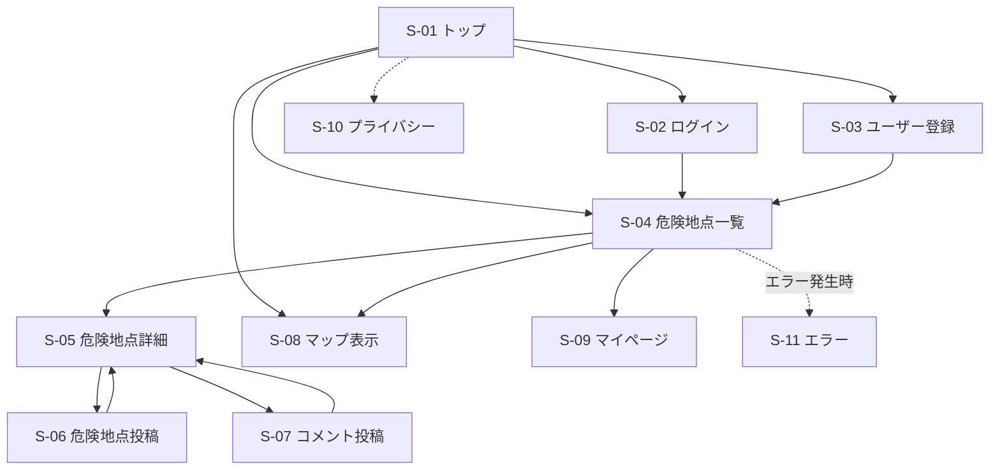

# SafeWalk VN-JP 外部設計書（ドラフト）

| 項目 | 内容 |
|---|---|
| プロジェクト名 | SafeWalk VN-JP |
| バージョン | 0.1（ドラフト） |
| 作成日 | 2026-05-25 |
| ステータス | レビュー前 |

> 本書は要件定義書 `要件定義書.md` を踏まえ、SafeWalk VN-JP の画面・機能・画面遷移など、外部から見える仕様を整理した外部設計書である。  
> 詳細な UI デザイン・ワイヤーフレームは Figma にて別途作成予定とする。

---

# 1. 画面一覧

## 1.1 画面（GET でビューを返すもの）

| ID | 画面名 | URL | コントローラ.アクション | 認証 | 概要 |
|---|---|---|---|---|---|
| S-01 | トップ | `/` | `HomeController.Index` | 不要 | アプリ概要・危険道路共有サービス紹介 |
| S-02 | ログイン | `/Identity/Account/Login` | `Identity Login` | 不要 | メール / パスワード認証 |
| S-03 | ユーザー登録 | `/Identity/Account/Register` | `Identity Register` | 不要 | ユーザー新規登録 |
| S-04 | 危険地点一覧 | `/DangerSpots` | `DangerSpotsController.Index` | 不要 | 危険地点一覧・検索・タグ表示 |
| S-05 | 危険地点詳細 | `/DangerSpots/Details/{id}` | `DangerSpotsController.Details` | 不要 | 危険地点詳細・コメント表示 |
| S-06 | 危険地点投稿 | `/DangerSpots/Create` | `DangerSpotsController.Create` | 要 | 危険地点投稿フォーム |
| S-07 | コメント投稿 | `/Comments/Create/{dangerSpotId}` | `CommentsController.Create` | 要 | コメント投稿フォーム |
| S-08 | マップ表示 | `/Map` | `MapController.Index` | 不要 | Google Map 上で危険地点表示 |
| S-09 | マイページ | `/MyPage` | `MyPageController.Index` | 要 | 自分の投稿一覧表示 |
| S-10 | プライバシー | `/Home/Privacy` | `HomeController.Privacy` | 不要 | プライバシーポリシー |
| S-11 | エラー | `/Home/Error` | `HomeController.Error` | 不要 | エラー表示画面 |

---

## 1.2 画面を持たない POST アクション

| アクション | URL | トリガー | 概要 |
|---|---|---|---|
| ログアウト | `POST /Identity/Account/Logout` | ナビバー | サインアウト処理 |
| 危険地点削除 | `POST /DangerSpots/Delete/{id}` | マイページ | 投稿削除 |
| コメント削除 | `POST /Comments/Delete/{id}` | マイページ | コメント削除 |

---

# 2. 画面遷移図

> 認証が必要な画面（S-06〜S-09）へ未ログインでアクセスした場合、ログイン画面へリダイレクトする。

---

# 3. 各画面ワイヤーフレーム概要

## S-01 トップ

- アプリ概要説明
- 「危険地点を見る」ボタン
- ログイン / 新規登録導線
- ベトナム交通事情説明
- 危険道路共有コンセプト表示

---

## S-02 ログイン

- メールアドレス入力
- パスワード入力
- ログインボタン
- 新規登録リンク
- 認証エラー表示領域

---

## S-03 ユーザー登録

- ユーザー名
- メールアドレス
- パスワード
- 登録ボタン
- ログイン画面リンク

---

## S-04 危険地点一覧

- ナビバー
- 検索バー
- 条件フィルタ
  - 横断困難
  - 歩道なし
  - バイク密集
  - 夜危険
  - 観光客注意
- 危険地点カード一覧
  - 地点名
  - 危険度
  - タグ
  - 写真
- 詳細画面リンク

---

## S-05 危険地点詳細

- 地点名
- 危険度表示
- 住所 / エリア名
- 地図表示
- 危険タグ
- 写真表示
- 危険内容説明
- コメント一覧
- 投稿ボタン
- コメント投稿ボタン

---

## S-06 危険地点投稿

- 地点名入力欄
- 危険内容入力欄
- 危険度入力（1〜5）
- タグ選択
- 写真アップロード
- 投稿ボタン
- キャンセルボタン

---

## S-07 コメント投稿

- コメント入力欄
- 投稿ボタン
- キャンセルボタン

---

## S-08 マップ表示

- Google Map 表示
- 危険地点ピン表示
- 危険度色分け
- ピンクリックで詳細遷移

---

## S-09 マイページ

- 自分の投稿一覧
- 自分のコメント一覧
- 削除ボタン
- ログアウトボタン

---

## S-10 プライバシー

- プライバシーポリシー表示

---

## S-11 エラー

- エラーメッセージ表示
- トップページリンク
- RequestId表示

---

# 4. 機能一覧

## 4.1 機能要件

| ID | 機能名 | 関連画面 | 概要 | 認証 | 権限 |
|---|---|---|---|---|---|
| F-01 | ユーザー登録 | S-03 | 新規ユーザー登録 | 不要 | – |
| F-02 | ログイン | S-02 | Cookie認証 | 不要 | – |
| F-03 | ログアウト | ナビバー | ログアウト処理 | 要 | ログインユーザー |
| F-04 | 危険地点一覧表示 | S-04 | 危険地点一覧表示 | 不要 | 全ユーザー |
| F-05 | 検索・タグフィルタ | S-04 | 条件検索 | 不要 | 全ユーザー |
| F-06 | 危険地点詳細表示 | S-05 | 危険地点詳細表示 | 不要 | 全ユーザー |
| F-07 | 危険地点投稿 | S-06 | 危険地点投稿 | 要 | ログインユーザー |
| F-08 | コメント投稿 | S-07 | コメント投稿 | 要 | ログインユーザー |
| F-09 | マップ表示 | S-08 | Google Map 表示 | 不要 | 全ユーザー |
| F-10 | マイページ表示 | S-09 | 投稿一覧表示 | 要 | ログインユーザー |
| F-11 | 投稿削除 | S-09 | 投稿削除 | 要 | 投稿者本人 |

---

## 4.2 危険タグ一覧

- 横断困難
- 歩道なし
- バイク密集
- 夜危険
- 信号なし
- 観光客注意
- 交通量多い

---

## 4.3 危険度基準

| 条件 | 加点 |
|---|---|
| 信号なし | +2 |
| 歩道なし | +2 |
| バイク密集 | +3 |
| 夜暗い | +2 |
| 横断困難 | +3 |

> 合計点をもとに危険度（1〜5）を表示する。

---

## 4.4 権限ルール

| 操作 | 権限 |
|---|---|
| 危険地点一覧・詳細閲覧 | 全ユーザー |
| 危険地点投稿 | ログインユーザー |
| コメント投稿 | ログインユーザー |
| 投稿削除 | 投稿者本人のみ |

---

# 5. 使用予定技術

| 分類 | 技術 |
|---|---|
| フロントエンド | ASP.NET Core MVC / Bootstrap |
| バックエンド | ASP.NET Core 9 |
| ORM | Entity Framework Core |
| DB | PostgreSQL |
| 認証 | ASP.NET Core Identity |
| 地図 | Google Maps API |
| バージョン管理 | Git / GitHub |

---

# 改訂履歴

| 改定日 | バージョン | 改訂者 | 改定箇所 | 改定内容 |
|---|---|---|---|---|
| 2026-05-25 | 0.1 | 担当者 | – | 初版作成（画面一覧 / 画面遷移図 / ワイヤーフレーム概要 / 機能一覧） |